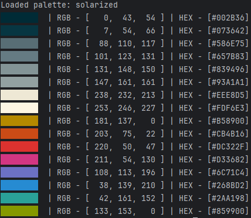

# Go Color Palette Generator

---


**Go Color Palette Generator** — простой терминальный генератор цветовых палитр на языке Go.
На основе случайно сгенерированного базового цвета программа подбирает 4 дополнительных цвета по принципу равномерного распределения оттенков (по «правилу пятиугольника») и выводит их с визуальным отображением в терминале.

### Особенности:

* Генерация 5 гармоничных цветов на основе одного RGB-цвета.
* Вывод цветных блоков с кодами RGB и HEX.
* Лёгкая реализация без внешних зависимостей, только стандартная библиотека Go.
* Использование ANSI escape-последовательностей для цветного вывода.

### Использование:

1. Запуск программы выводит палитру из 5 цветов.
2. Каждый цвет представлен цветным блоком и описанием в формате RGB и HEX.


### Flags:

 --conf [solarized] 

 -- rgb [asdf]


```
GoWall/
├── cmd/
│    └── palettegen/
│         ├── main.go
│         └── palettes.json
├── pkg/
│    ├── color.go
│    ├── config.go
│    └── html.go
└── go.mod
```