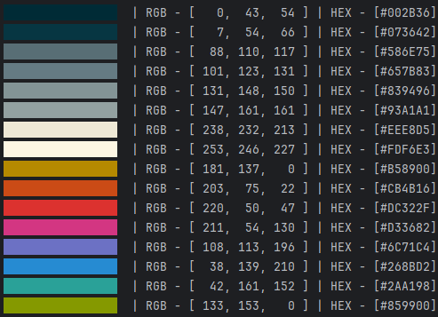

# Terminal color palette generator.

---


---

### Flags:

| Flag    | Description                                     | Example              |
|---------|-------------------------------------------------|----------------------|
| -html   | name of HTML file to output the palette         | -html "palette.html" |
| -base   | base color in R,G,B format for [rgb] mode       | -base "60,90,120"    |
| -conf   | palette name from palettes.json                 | -conf solarized      |
| -mode   | generation mode, standard mode [rgb]: [rgb/hsv] | -mode hsv            |
| -count  | colors in the palette [2–5]                     | -count 5             |

### Usage:
```
git clone https://github.com/username/gowall.git
cd gowall
go build -o gowall ./cmd/palettegen

./gowall -count 5
./gowall -mode hsv -count 3
./gowall -base "60,90,120"
./gowall -conf solarized
./gowall -html "palette.html"
```
