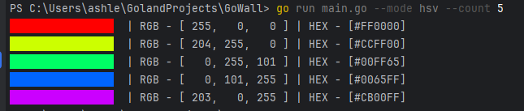

# Go Color Palette Generator

---

**Go Color Palette Generator** — простой терминальный генератор цветовых палитр на языке Go.
На основе случайно сгенерированного базового цвета программа подбирает 4 дополнительных цвета по принципу равномерного распределения оттенков (по «правилу пятиугольника») и выводит их с визуальным отображением в терминале.

### Особенности:

* Генерация 5 гармоничных цветов на основе одного RGB-цвета.
* Вывод цветных блоков с кодами RGB и HEX.
* Лёгкая реализация без внешних зависимостей, только стандартная библиотека Go.
* Использование ANSI escape-последовательностей для цветного вывода.

### Использование:

1. Запуск программы выводит палитру из 5 цветов.
2. Каждый цвет представлен цветным блоком и описанием в формате RGB и HEX.

### Roadmap проекта:

1. Добавление HSV-цветов.
2. Добавление -- флагов.
3. Генерация палитры с параметрами (кол-во цветов, палитра [ 4 пункт ]).
4. Генерация стандартных цветовых палитр из JSON файла конфигурации.
5. Рефакторинг проекта, разделенеие проекта по файлам и реализация расширяемости.
6. Создание документации (ReadMe.md), маскот (?).
7. Сборка финальной версии проекта.
8. Открытие репозитория.

